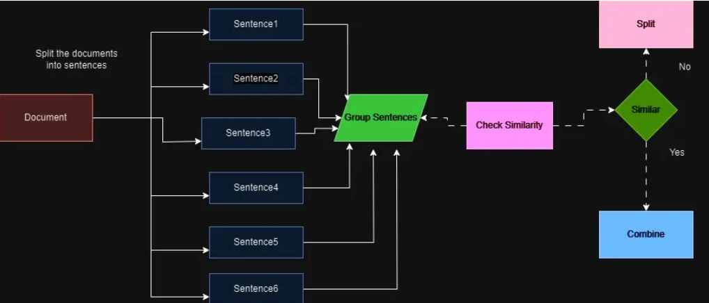
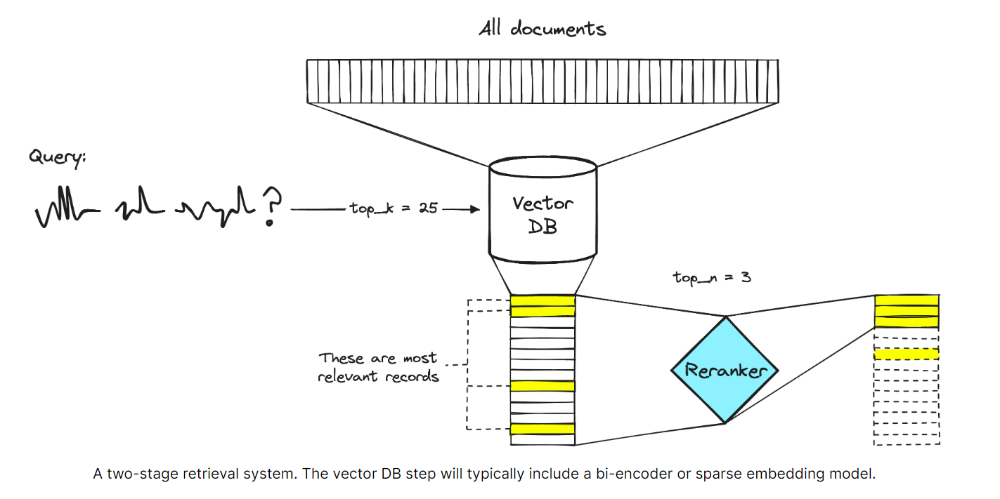

# ⚡Agent Workflow: A Technical Deep Dive

---


---

<pre>
✅ Citing References          ✅ Summary for history     ✅ Serverless Deployment   
✅ Conversational Memory      ✅ Opensource LLM          ✅ Opensource DB         
</pre>

## Quickstart

- Start with cloning this repo
```
git clone https://github.com/SriPrarabdha/ema-take-home-challenge.git
```

- add your data files onto ```data/``` folder

- Create your own .env file and add the Groq api key
```
GROQ_API_KEY = "<API-KEY>"
```

- run ```python data_ingestion.py``` to ingest and store the data locally

- run ```python main.py``` to chat with your notes

- OR use the deployed api - 

## 1. User Documents

The workflow commences with the user's documents, which form the foundational knowledge base for the chatbot system. These documents can encompass a wide range of formats, such as PDFs, Word files, or plain text files. To accommodate this diversity of document formats, a robust and versatile document loading mechanism is essential.

## 2. LangChain - Document Loader

The Document Loader is responsible for ingesting and processing the user's documents, handling the parsing and conversion of various document types. It ensures that the textual content is extracted and structured in a standardized format, enabling seamless data flow and efficient handling of diverse document sources. This step is crucial for ensuring compatibility with subsequent stages of the workflow, enabling smooth integration and data processing.

## 3. Semantic Chunking

Once the documents have been loaded and their content extracted, the next step is semantic chunking. This process involves dividing the text into smaller, meaningful chunks or segments based on their semantic context and relationships. 



Semantic chunking is essential for several reasons:

- **Efficiency Enhancement**: By breaking down large blocks of text into more manageable units, the embedding model's efficiency is improved, enabling faster and more efficient processing.

- **Contextual Preservation**: Semantic chunking preserves the contextual relationships within the text, ensuring that related concepts and ideas are grouped together, facilitating more accurate and relevant responses.

- **Focused Retrieval**: By allowing the chatbot to focus on specific chunks of information relevant to the user's query, semantic chunking enhances the precision and relevance of the retrieved information.

## 4. Embedding Model

The embedding model's primary function is to convert the semantically chunked text segments into high-dimensional vector representations. These embeddings encode the underlying meaning and context of the text, enabling the system to perform computations and comparisons in the vector space, facilitating tasks such as similarity measurement, clustering, and information retrieval.We are using Fastembed by qdrant as our embedding model.

### 📈 Why FastEmbed?

- Light: FastEmbed is a lightweight library with few external dependencies. We don't require a GPU and don't download GBs of PyTorch dependencies, and instead use the ONNX Runtime. This makes it a great candidate for serverless runtimes like AWS Lambda.

- Fast: FastEmbed is designed for speed. We use the ONNX Runtime, which is faster than PyTorch. We also use data-parallelism for encoding large datasets.

- Accurate: FastEmbed is better than OpenAI Ada-002. We also supported an ever expanding set of models, including a few multilingual models.

## 5. Vector Store (qdrant)

Qdrant is a open source vector similarity search engine and vector database. It provides a production-ready service with a convenient API to store, search, and manage points—vectors with an additional payload Qdrant is tailored to extended filtering support. It makes it useful for all sorts of neural-network or semantic-based matching, faceted search, and other applications.

By using Qdrant locally we can ensure better privacy of user data

## 6. Base Retriever & LangChain

The Base Retriever component, together with LangChain, facilitates the retrieval of relevant information from the vector store based on the user's query. LangChain provides a high-level interface for interacting with the vector store, enabling efficient querying and retrieval of the most relevant embeddings and their associated textual content.

The Base Retriever acts as an intermediary between the user's query and the vector store, translating the query into a suitable format for the vector store's search algorithms. It leverages the capabilities of LangChain to perform vector similarity searches, retrieving the most relevant embeddings and their corresponding textual chunks from the knowledge base.

## 7. Rerankers



Reranking seeks to improve search relevance by reordering the result set returned by a retriever with a different model.

Reranking computes a relevance score between the query and each data object, and returns the list of objects sorted from the most to the least relevant. Computing this score for all (query, data_object) pairs would typically be prohibitively slow, which is why reranking is used as a second stage after retrieving the relevant objects first.

As the reranker works on a smaller subset of data after retrieval, different, potentially more computationally expensive approaches can be used to improve search relevance.

## 8. Response Generation

The response generation stage leverages the collective output of the preceding components, including the retrieved and reranked textual chunks, as well as any additional context and chat history associated with the user's query with Groq based Llama3 llm.

## Future Deployment and Scaling Approaches

As the number of lectures, papers, or other educational resources grows, the chatbot system must be designed to scale efficiently and maintain its performance. Here are some potential deployment and scaling approaches:

1. **Distributed Vector Store**: To handle a large volume of embeddings and ensure efficient retrieval, the vector store (qdrant) can be distributed across multiple nodes or servers. This distributed architecture allows for parallel processing, load balancing, and horizontal scaling, enabling the system to handle an increasing number of embeddings without compromising performance.

2. **Sharding and Partitioning**: The knowledge base can be partitioned or sharded based on specific criteria, such as subject matter, domains, or topics. Each shard or partition can have its own dedicated vector store, embedding model, and associated components. This approach not only enhances scalability but also enables specialized processing and optimization for different knowledge domains.

3. **Incremental Indexing and Updates**: Instead of reindexing the entire knowledge base every time new content is added, an incremental indexing and updating mechanism can be implemented. This approach allows for efficient integration of new documents or resources into the existing vector store and knowledge base, minimizing downtime and ensuring seamless operation.

4. **Caching and Precomputation**: Frequently accessed or computationally intensive operations, such as embedding generation or similarity searches, can be cached or precomputed to reduce latency and improve overall system performance. This approach can be particularly beneficial for handling frequently asked queries or retrieving information from commonly accessed knowledge domains.

5. **Replacing Langchain**: However easy it may be to prototype our ai applications in langchain. But we should stop using langchain after prototyping. We should develop our own agent orchestration tools for a product in production